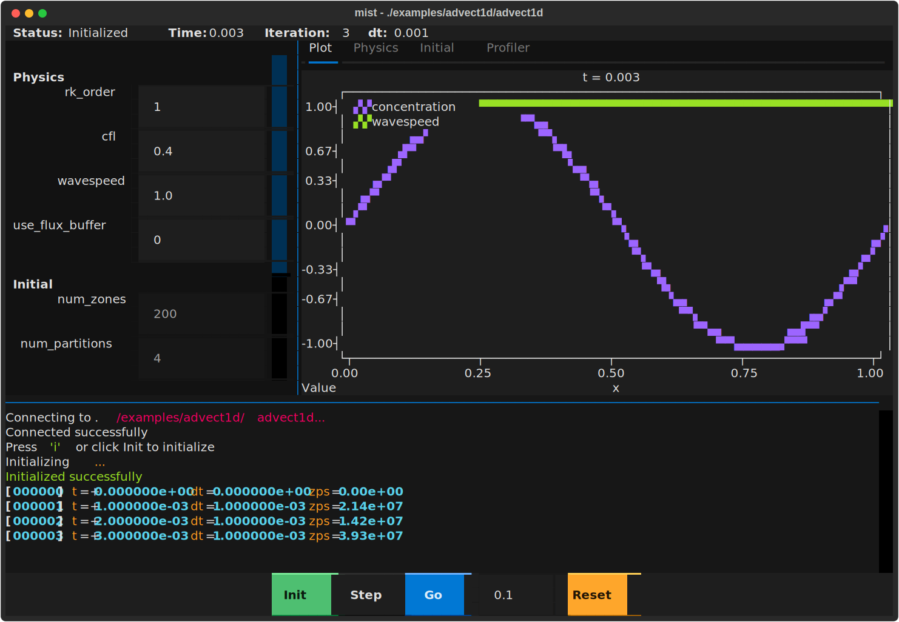

# Mist

A lightweight C++20 library for deploy-anywhere physics simulations.

Mist is an evolution of [Vapor](https://github.com/clemson-cal/vapor), a library with similar goals for HPC physics applications.

## Features

- **CUDA compatible**: All functions work on both CPU and GPU (CUDA 12+)
- **Zero dependencies**: Pure C++20 standard library
- **Interactive driver**: Time-stepping REPL with checkpoint/restart
- **Multiple interfaces**: via mist program (example below), interactive REPL, Python, terminal UI

## Quick Start

Try an example:

```bash
git clone https://github.com/jzrake/mist.git
cd mist
cmake .
make
./examples/advect1d/advect1d
```

Start a new project:

```bash
mkdir my_sim && cd my_sim
git init
git submodule add https://github.com/jzrake/mist.git
```

Create `CMakeLists.txt`:

```cmake
cmake_minimum_required(VERSION 3.20)
project(my_sim LANGUAGES CXX)
add_subdirectory(mist)
add_executable(my_sim main.cpp)
target_link_libraries(my_sim PRIVATE mist_driver)
```

Create `main.cpp` (see Micro-Demo below), then build:

```bash
cmake -B build
cmake --build build
./build/my_sim
```

## Micro-Demo

A minimal mist physics module:

```cpp
#include "mist/driver.hpp"

struct my_physics {
    struct config_t {
        double cfl = 0.4;
        auto fields() const { return std::make_tuple(field("cfl", cfl)); }
        auto fields() { return std::make_tuple(field("cfl", cfl)); }
    };
    struct initial_t { ... };
    struct state_t { ... };
    struct product_t { ... };
    struct exec_context_t { ... };
};

// Required free functions
auto default_physics_config(std::type_identity<my_physics>) -> my_physics::config_t;
auto initial_state(const my_physics::exec_context_t&) -> my_physics::state_t;
void advance(my_physics::state_t&, const my_physics::exec_context_t&, double dt_max);
// ... see docs/driver.md for full interface

int main() {
    auto physics = mist::driver::make_physics<my_physics>();
    auto state = mist::driver::state_t{};
    auto engine = mist::driver::engine_t{state, *physics};
    auto session = mist::driver::repl_session_t{engine};
    session.run();
}
```

## Interaction Methods

### Interactive REPL

Direct command-line interaction with readline support:

```
$ ./advect1d
> show physics
physics {
    rk_order = 1
    cfl = 0.4
    wavespeed = 1.0
}
> init
[000000] t=0.00000
> t -> 1.0
[000500] t=1.0000 zps=2.954e7
> write checkpoint
Wrote chkpt.0000.dat
> stop
```

### Scripted Runs

Program execution via heredoc:

```bash
./advect1d << EOF
set initial num_zones=1000
repeat 1 n show iteration
init
t -> 1.0
write checkpoint
stop
EOF
```

### Python Interface

Programmatic control via socket:

```python
from mist import Mist

with Mist("./advect1d") as sim:
    sim.init()
    sim.advance_to(1.0)
    print(f"time={sim.time}, iteration={sim.iteration}")
    data = sim.products["concentration"]
```

### Terminal UI

Visual interface with live plotting:

```bash
python -m mist ./advect1d
```



The TUI provides:
- Live plots of selected products
- Config editing (physics always, initial before init)
- Keyboard shortcuts: `i` init, `s` step, `g` go, `r` reset, `q` quit

## Documentation

- [Core Library](docs/core.md) — vectors, index spaces, arrays, serialization
- [Driver](docs/driver.md) — interactive time-stepping, commands, physics interface
- [Parallelism](docs/parallelism.md) — scheduling, pipelines, profiling

## Building

From project root:

```bash
make          # build examples and run tests
make clean    # clean build artifacts
```

Examples are in `examples/` subdirectories with their own Makefiles.

## CUDA Compatibility

All functions are annotated with `__host__ __device__` when compiled with nvcc:

```cpp
auto result = cache(
    map(device_data, [] MIST_HD (double x) { return x * 2.0; }),
    memory::device, exec::gpu
);
```
